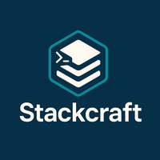

# Stackcraft


<p align="center">
  
</p>

Stackcraft is a tool that will build a new project with a complete structure including:

- folder organization
- a base eUI frontend
- a base ExpressJS backend
- and generate SQL for the database.

## Features

- **Project Structure Generation**: Automatically creates organized folder structures for new projects
- **Frontend Setup**: Sets up a base eUI/Angular frontend application
- **Backend Setup**: Configures a base ExpressJS backend server
- **Database Integration**: Generates SQL scripts and database setup
- **Full Stack**: Complete solution for structured web application development

## Getting Started

To get started with Stackcraft, simply clone the repository and install the dependencies:

```bash
git clone https://github.com/maquejp/stackcraft.git
cd stackcraft
npm install
```

## Documentation

## 🚀 Installation

```bash
npm install @maquestiaux-foundry/stackcraft -g
```

---

## Contributing

We welcome contributions from the community! If you'd like to contribute, please fork the repository and create a pull request with your changes. Make sure to follow the coding standards and include tests for any new features.

## License

This project is licensed under the EUPL-1.2 License. See the [LICENSE](LICENSE) file for details.
